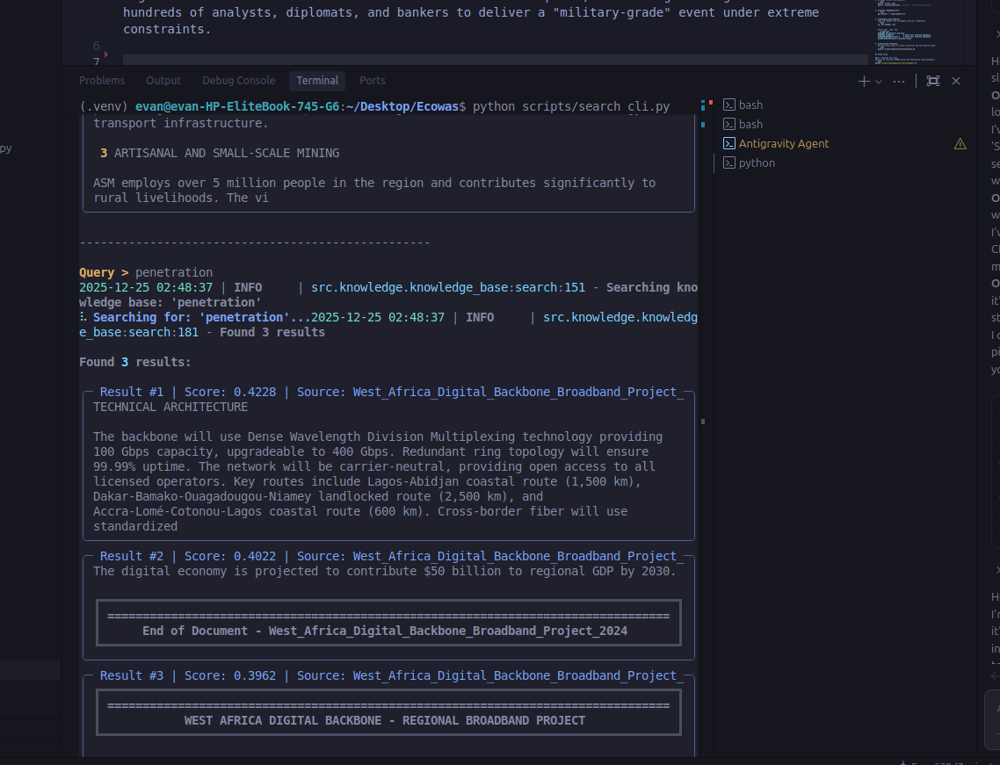

# Martin SMAS - The Summit OS 🌍

**The Operating System for the 2026 ECOWAS Economic Development Summit.**

Martin SMAS (Sovereign Multi-Agent System) is a federated AI ecosystem designed to serve as the digital backbone for the summit. It acts as a force multiplier, simulating the cognitive labor of hundreds of analysts, diplomats, and bankers to deliver a "military-grade" event under extreme constraints.


## System Status 🟢

**Phase 1: Knowledge Core (Online)**
- ✅ **Ingestion Engine**: Operational (Processing Treaties, Policies, Feasibility Studies)
- ✅ **Vector Sovereignty**: Private Pinecone Clusters (AWS us-east-1)
- ✅ **Neural Search**: Validated (Semantic retrieval active)
- ⏳ **Agent Swarm**: Phase 2 Initialization Pending

## Quick Start

### 1. Initialize the OS
```bash
# Setup environment & Pinecone index
python scripts/setup/initialize_project.py
```

### 2. Ingest Intelligence
Load the summit data (Treaties, Vision 2050, Project Params) into the neural core:
```bash
python scripts/ingest/batch_ingest.py
```

### 3. Interrogate the System
Use the interactive CLI to search the knowledge base:
```bash
python scripts/search_cli.py
```

### Prerequisites

- **Python 3.10+**
- **Ollama** running locally with:
  - `qwen2.5:14b` (LLM)
  - `nomic-embed-text` (Embeddings)
- **Pinecone** account (API Key)
- **Google Cloud** API Key (optional)

### Installation Steps

1. **Clone and Navigate**:
   ```bash
   cd /home/evan/Desktop/Ecowas
   ```

2. **Create Virtual Environment**:
   ```bash
   python -m venv .venv
   source .venv/bin/activate  # Windows: .venv\Scripts\activate
   ```

3. **Install Dependencies**:
   ```bash
   pip install -r requirements.txt
   ```

4. **Configure Environment**:
   Copy the example file and update with your credentials:
   ```bash
   cp .env.example .env
   ```
   
   Ensure your `.env` has:
   ```properties
   PINECONE_API_KEY=your_key_here
   PINECONE_CLOUD=aws           # Check your Pinecone dashboard
   PINECONE_REGION=us-east-1    # Check your Pinecone dashboard
   OLLAMA_BASE_URL=http://localhost:11434
   ```

5. **Initialize Project**:
   Run the setup script to create directories and the Pinecone index:
   ```bash
   python scripts/setup/initialize_project.py
   ```

## Usage Guide

### 1. Generate Test Data
Generate 10 realistic ECOWAS policy and feasibility study documents:
```bash
python scripts/setup/generate_test_documents.py
```
*Outputs text files to `data/raw/` including Vision 2050, Mining Policy, and Infrastructure Projects.*

### 2. Ingest Documents
Process documents, generate embeddings, and upload to Pinecone:
```bash
python scripts/ingest/batch_ingest.py
```

### 3. Query Knowledge Base
Test semantic search capabilities:
```bash
python examples/knowledge_base_usage.py
```

Or usage in Python:
```python
from src.knowledge.knowledge_base import KnowledgeBase

kb = KnowledgeBase()
results = kb.search("ECOWAS Vision 2050", top_k=3)
for res in results:
    print(f"{res['score']}: {res['metadata']['source']}")
```

## Troubleshooting

- **Pinecone Region Error**: If you see `Resource ... not found`, check your `.env` settings (`PINECONE_CLOUD`, `PINECONE_REGION`) match your Pinecone console.
- **Ollama Connection**: Ensure `ollama serve` is running.
- **Import Error**: Make sure your virtual environment is activated (`source .venv/bin/activate`).

## Development

### Running Tests
```bash
python -m pytest tests/
```

### Project Structure
```
/home/evan/Desktop/Ecowas/
├── src/                    # Source code (Agents, Ingestion, Knowledge)
├── scripts/               # Setup and Ingestion scripts
├── data/                 # Data storage (raw, processed)
├── config/              # Configuration files
```

## License
Proprietary - ECOWAS Economic Development Summit 2026
